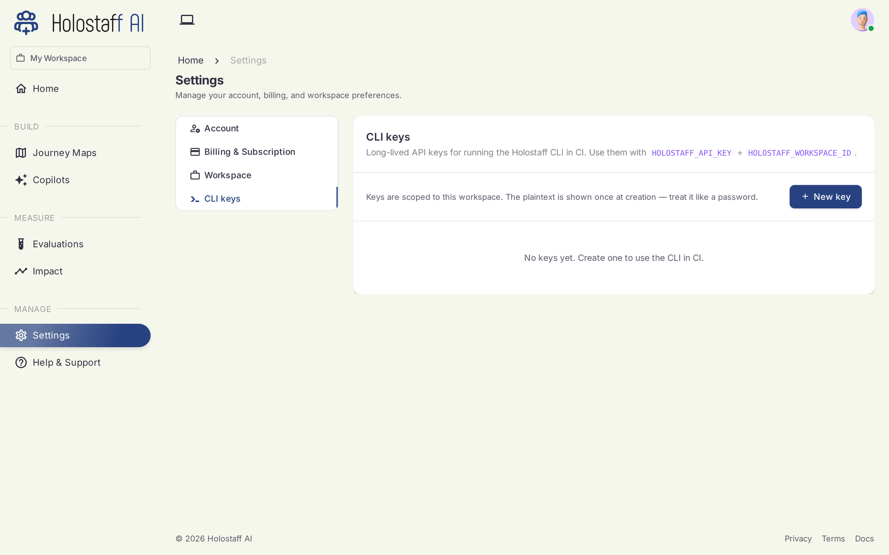

# CLI Reference

`@holostaff/cli` is the front door: scan, refine, instrument, embed, and deploy, all from your terminal.

```bash
npx @holostaff/cli        # or: npm install -g @holostaff/cli
```

Requires Node 20+. Running it bare opens the interactive shell; anything you type that doesn't start with `/` is free-form conversation with the agent.

## Slash commands (interactive shell)

| Command | Purpose |
|---|---|
| `/scan` | Scan this repo, produce and upload the journey-map artifact |
| `/scan --add-repo` | Merge this repo into an existing source (multi-repo product) |
| `/refine` | Edit the product's identity (name, description, notes) without re-scanning |
| `/instrument` | Draft the SDK integration patch, show the diff, commit to a branch |
| `/embed` | Add the copilot presence to your app entry, commit to a branch |
| `/whoami` · `/workspace` · `/login` · `/logout` | Auth and session utilities |
| `/help` · `/quit` | Help / exit |

## Subcommands (scriptable)

| Command | Purpose |
|---|---|
| `holostaff` | Open the interactive shell |
| `holostaff scan [--quiet --json --out PATH]` | Headless scan and upload (CI-friendly) |
| `holostaff import NAME` | Import a [preset journey map](presets.md) instead of scanning (`import` alone lists them) |
| `holostaff deploy [--dry-run] [--force]` | Open the deploy PR ([details](../deploy/index.md)) |
| `holostaff embed` | Non-interactive embed |
| `holostaff login` / `logout` / `whoami` / `workspace` | Auth and session |

## The two-phase scan

`/scan` publishes in two phases so you never wait on a long scan to see your map:

1. **Skeleton** — routes, components, and workflows with stages, live in about 90 seconds.
2. **Deep pass** — risks, interventions, signals, copy, brand voice; lands as a second version while you explore. The dashboard shows the source as "deepening" until it completes.

Pass 1 uploads automatically; opt out with `--no-auto-upload`.

## What stays on your machine

`/scan` reads your source with read-only tools, but the uploaded artifact contains only:

- Product identity: name, one-line description, framework, language
- Routes (paths and descriptions) and component names with roles
- Customer-facing copy strings, with their file locations
- Brand voice (tone, keywords)
- Workflows and their steps
- Coverage gaps the scan flagged

Your source code, file contents beyond the excerpted UI strings, `.env` files, secrets, and git history never leave your machine. The **trust report** shows exactly what is about to be sent, before you confirm.

## Auth

**Interactive (default).** Device flow: the browser opens, you confirm. Credentials live in `~/.holostaff/credentials.json` (mode `0600`).

**CI.** Set two environment variables and the CLI skips the file-based path:

```bash
export HOLOSTAFF_API_KEY="hsk_…"
export HOLOSTAFF_WORKSPACE_ID="workspace_…"
```

### CI keys

Generate workspace API keys in the dashboard under **Settings → CLI keys**. The plaintext shows once, at creation. Treat it like a password.



## CI mode

```bash
holostaff scan --quiet --json --out artifact.json
jq -r '.upload.viewUrl' artifact.json
```

Exit codes: `0` uploaded · `1` scan or upload failed · `2` bad args or missing env · `3` auth not configured.

## Per-repo source binding

After the first successful upload, the CLI writes `.holostaff/source.json` in your repo. Later scans bind to the same source and version-bump its artifact. Add it to `.gitignore` if you don't want teammates' scans landing on your source automatically.
