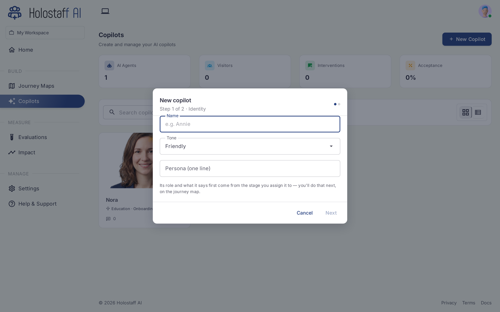
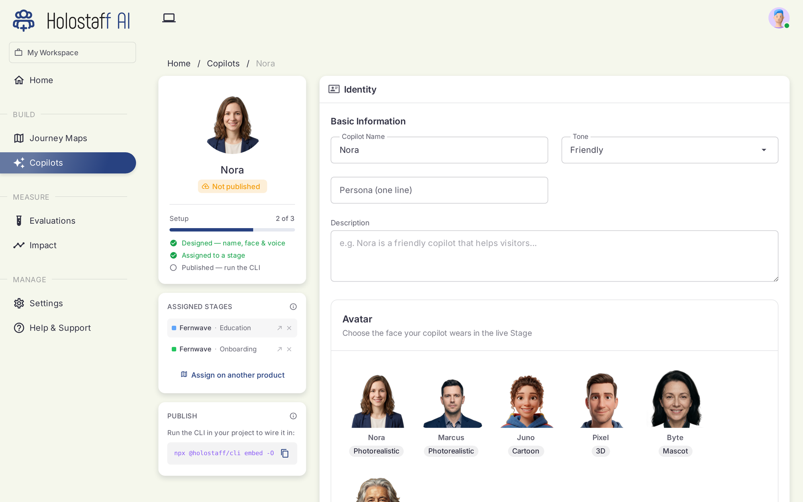

# Creating a Copilot

Hiring takes two steps: identity, then face and voice. Assignment and publishing happen on the copilot's page afterwards.

## Step 1: Identity

Click **New Copilot** on the roster.



- **Name.** What users will see. Short first names work best.
- **Tone.** How it speaks: friendly, formal, concise.
- **Persona.** One line of "who is this": you'll see it again first thing on the stage, so make it true.
- **Description.** Optional depth: anything the copilot should know about how to do its job.

## Step 2: Face and voice

Pick an avatar from the catalog. Each has a matched face and voice, in photorealistic, cartoon, 3D, and mascot styles. The avatar is the face your copilot wears in the live Stage: the on-screen presence users talk to.

Want your own? Custom avatars can be added to your workspace; contact support to enable them.

## The copilot page

Every copilot has a page tracking its setup from designed to live:



- **Setup checklist.** Designed → Assigned to a stage → Published.
- **Assigned stages.** The product and stage pairs this copilot owns. Assign from here or from the map's [Journey view](../journey-maps/canvas.md#design-view-and-journey-view).
- **Publish.** Wiring the copilot into your product happens from your repo, not from the dashboard:

```bash
npx @holostaff/cli embed
```

The CLI drafts the change, shows you the diff, and commits it to a branch. Shipping it to production goes through [the deploy flow](../deploy/index.md).

!!! note "Assignment is not deployment"
    Assigning a copilot to a stage stages the work in your dashboard. Users only meet the copilot after the deploy PR merges and the copilot is published.
