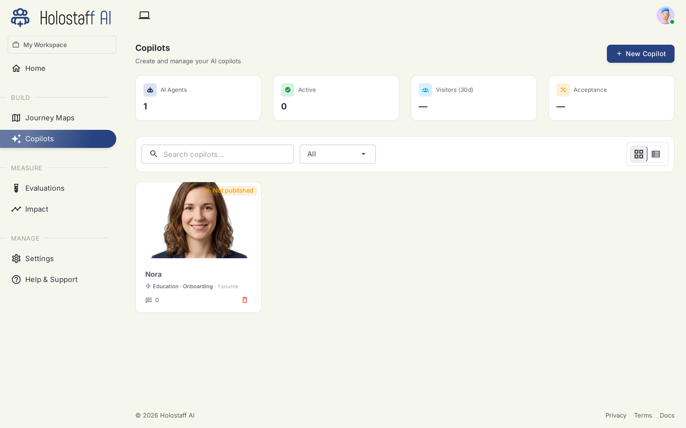

# Copilots

Copilots are your AI staff: the success managers who work inside your product. Each one owns a journey stage, watches its users, and steps in when someone struggles.

## What a copilot is

A copilot is defined by three things:

- **An identity.** A name, a tone, a one-line persona. This shapes how it talks.
- **A presence.** A face and a voice. In the live product, the copilot appears as a small presence chip that can expand into a talking, listening success manager on screen.
- **A job.** One or more journey stages on one or more products. The stage defines which users it watches and which risk moments it may act on.

## What a copilot does

When a user in its stage shows signs of struggle (stalling, looping, abandoning a form) the copilot can:

- **Nudge** — a small, dismissible note at the right moment
- **Talk** — voice conversation, seeing what the user sees
- **Guide** — point at the right element, walk the user through the step
- **Act** — with the user watching, take the stuck step together in a supervised session

Every intervention is logged and visible in [Impact](../impact/index.md).

## The roster

The Copilots page shows every staff member with status counters: AI agents, active, visitors reached, and acceptance. From here you create new copilots, open one to configure it, or pause it.

A copilot's lifecycle: **Designed** (name, face, voice) → **Assigned** (owns a stage) → **Published** (wired into your app via the CLI) → live.

## Next

- [Create a copilot](create.md)
- [Rehearse it before launch](../evaluations/index.md)
- [Ship it through a PR](../deploy/index.md)
