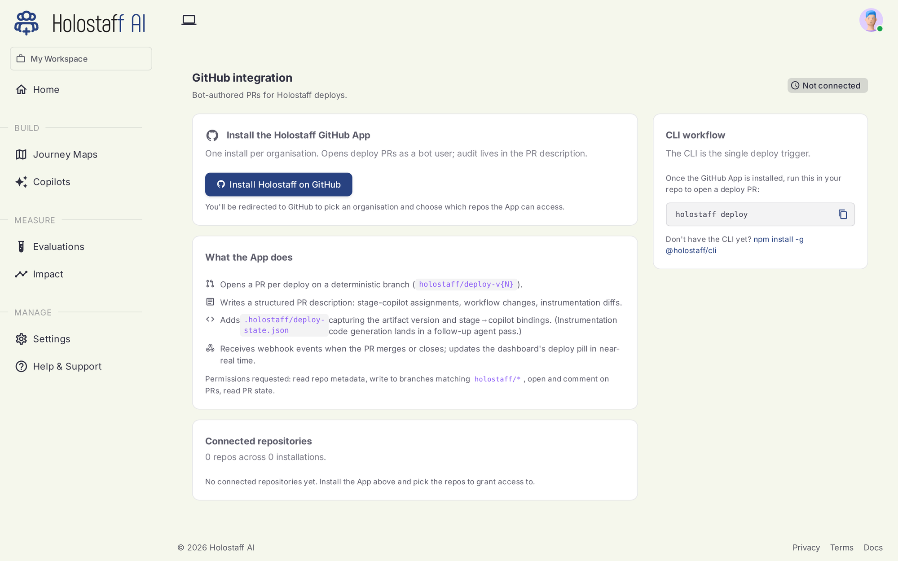
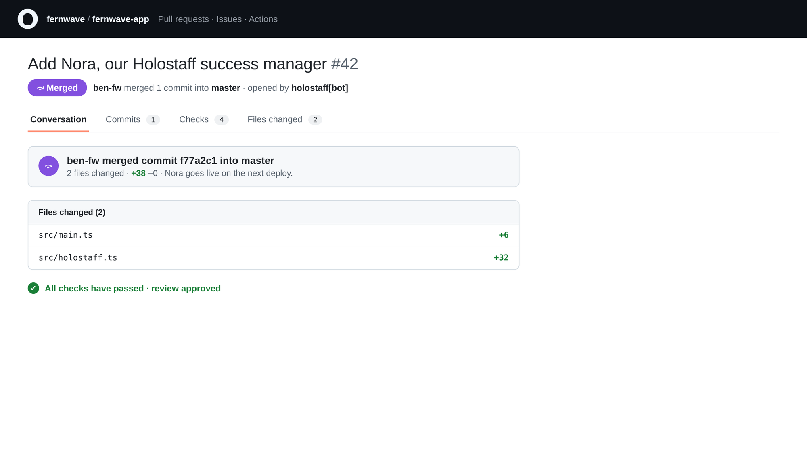

# Deploying

Nothing reaches your users without going through your own code review. Deployment is a pull request, opened by the Holostaff GitHub App, reviewed and merged by your engineers.

## Connect GitHub (one time)

Install the Holostaff GitHub App on your organization from **Integrations → GitHub** in the dashboard. The app's only job is opening deploy PRs on the repositories you allow.



## Run the deploy

From your repo:

```bash
npx @holostaff/cli deploy
```

The CLI:

1. Checks what's pending for this source: a new scan, edited assignments, or nothing.
2. Detects the target `owner/repo` from your git remote.
3. Registers the deploy and asks the server to open the PR.
4. Prints the PR URL.

Use `--dry-run` to see the plan without touching anything, and `--force` to push onto an open deploy non-interactively.

## The PR

The PR is small and readable: the SDK dependency, the `init` call, stage markers at journey boundaries, and the embed for the autopilot layer. Your team reviews it like any change.



Merging the PR makes the integration live. From that moment, certified autopilots with their toggle on start offering, and every handover streams into [Impact](../impact/index.md).

## Rolling back

Everything is revocable:

- **Turn an autopilot's deploy toggle off** on the Autopilots page: the integration stays, new offers stop instantly.
- **Revert the PR** to remove the integration entirely.

## Troubleshooting

| Error | Meaning | Fix |
|---|---|---|
| `no_repo` | No GitHub remote found | Run from a repo with an `origin` remote |
| `no-installation-for-repo` | GitHub App not installed for this org | Install it from Integrations → GitHub |
| An open deploy exists | A previous deploy PR is still open | Choose force-push, wait, or cancel at the prompt |
