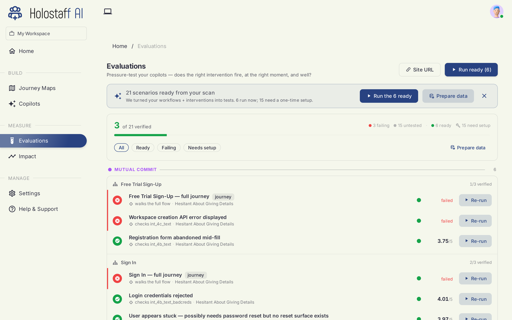
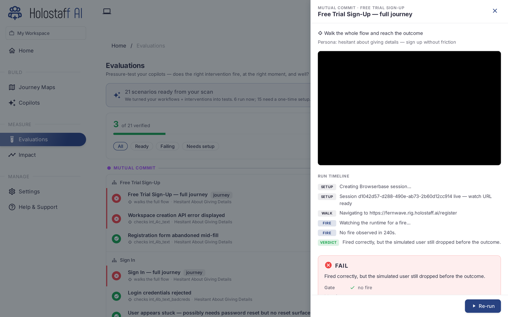

# Evaluations

Before a single real user meets your copilots, they rehearse. Evaluations pressure-test each copilot with simulated users: does the right intervention fire, at the right moment, and does it actually help?

## Where scenarios come from

Scenarios are generated from your scan. Every workflow and risk moment on your journey map becomes a test case: "walk the whole flow and reach the outcome", "hesitate about giving details", "abandon the form mid-fill". You don't write them; your map already contains them.

The board groups scenarios by stage and workflow, and tracks the counts that matter: verified, failing, untested, ready to run, and needing one-time setup (for example, scenarios that require test credentials).

## How a run works

A simulated user is an AI visitor driving a real browser session against your product:

1. A browser session starts and navigates to your app.
2. The persona plays its part: a hesitant sign-up, a stuck integrator, a user who quietly gives up.
3. Your copilot, running for real, must notice and intervene.
4. The run is judged: did the intervention fire correctly, did the simulated user reach the outcome?

Open any scenario row to see the run: the session timeline, a watch link for the live browser, the verdict, and the reason.

## Verdicts

- **Pass** — the intervention fired at the right moment and the user reached the outcome. Latency is recorded.
- **Fail** — with the reason. A fail can be the copilot's fault (fired correctly but didn't help) or a product finding (the simulated user hit a real bug). Both are worth knowing before launch.
- **Needs setup** — the scenario needs one-time data, like a seeded account.

Re-run any scenario after a change with its **Re-run** button, or run everything ready with **Run ready**.

## When to run evaluations

- After hiring a copilot, before its first deploy.
- After a re-scan that changed its stage's workflows.
- After editing identity or persona: tone changes behavior.
- Before go-live, as the gate: a copilot that can't pass rehearsal has no business meeting your users.
