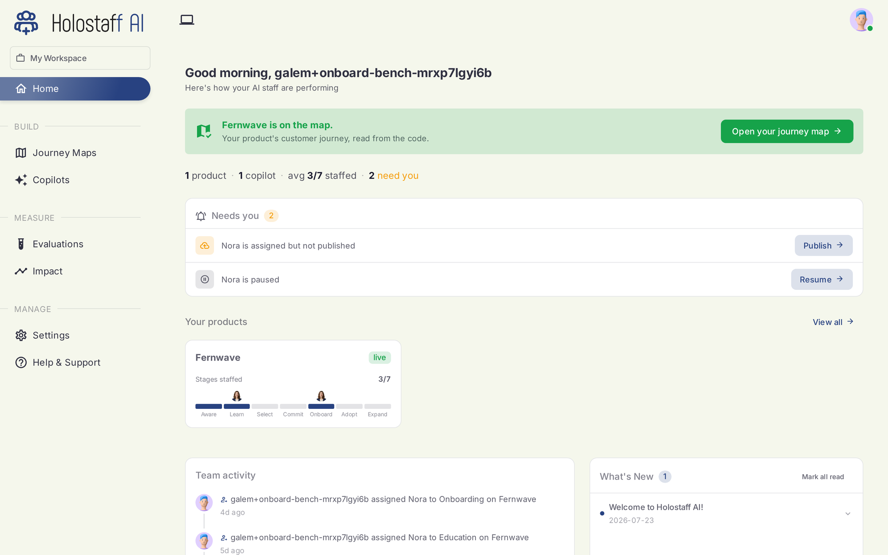

# The Dashboard

Home is a working view, not a vanity view. It tells you what state your product is in and what needs you next.

## What you see

**The map banner.** Once a scan lands, Home confirms your product is on the map and links straight to the [journey map canvas](../journey-maps/canvas.md).

**Coverage summary.** Products and how much of the seven-stage journey each covers.

**Needs you.** The queue of actions only you can take: a workflow certified but not yet live, a failing suite to look at, a re-scan with flagged changes to review. Each row carries its action button.

**Your products.** Every scanned product with its coverage bar. One workspace can hold several products; each gets its own journey map.

**Team activity.** Who changed what, and when.

## The navigation

The sidebar mirrors the lifecycle:

| Section | What it is |
|---|---|
| [Journey Maps](../journey-maps/index.md) | Your scanned products and their canvases |
| [Personas](../evaluations/index.md#synthetic-users) | Your synthetic users |
| [Autopilots](../autopilots/create.md) | One per workflow: certification state and the deploy toggle |
| [Environments](../evaluations/index.md#environments) | The deployments simulation runs point at |
| [Evaluations](../evaluations/index.md) | The coverage board: scenarios, runs, verdicts, clips |
| [Impact](../impact/index.md) | What changed, attributed |
| Settings | Account, billing, workspace, [CLI keys](../cli/index.md#ci-keys) |
| Help & Support | Docs and support |
