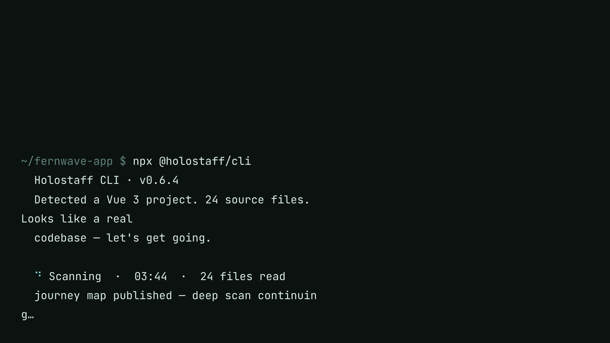

# Quickstart

The terminal is the front door. One command scans your codebase and puts your product's journey map on a live canvas. From there you hire copilots, rehearse them, and ship them through a pull request.

## 1. Run the CLI

In the repository of the app you want to staff:

```bash
npx @holostaff/cli
```

Requires Node 20+. The CLI signs you in with a device flow: your browser opens, you confirm, and the terminal continues. New here? The same flow creates your account and workspace.

## 2. Scan

```
> /scan
```

The scan agent reads your code the way an engineer would: routes, components, workflows, and the copy your users actually see.



The scan runs in two phases:

1. **Skeleton.** The structure of your journey map (routes, components, workflows with stages) is published the moment it is coherent. Your map is live in about 90 seconds.
2. **Deep pass.** The agent keeps working: risk moments, proposed interventions, signals, copy strings, brand voice. The finished artifact lands as a second version while you explore the map.

Before anything uploads, a trust report shows exactly what will be sent. Your source code stays on your machine; only the structured artifact goes up. See [what leaves your machine](../cli/index.md#what-stays-on-your-machine).

## 3. Open your map

When the skeleton lands, the CLI prints your workspace URL. Your dashboard greets you with the scanned product:


From here the path is:

1. **[Explore the Journey Map](../journey-maps/index.md).** See every user journey the scan found, with drop-off risks flagged.
2. **[Hire a copilot](../copilots/create.md).** Give it a face, a voice, and a stage to own.
3. **[Rehearse it in Evaluations](../evaluations/index.md).** Simulated users pressure-test it before any real user meets it.
4. **[Deploy through a PR](../deploy/index.md).** `npx @holostaff/cli deploy` opens a pull request your engineers review.
5. **[Watch Impact](../impact/index.md).** See the interventions fire and the funnel move.

!!! tip "A scan is not a deploy"
    Scanning makes your **map** live in the dashboard. Nothing changes in your product until you deploy a copilot through the PR path.
