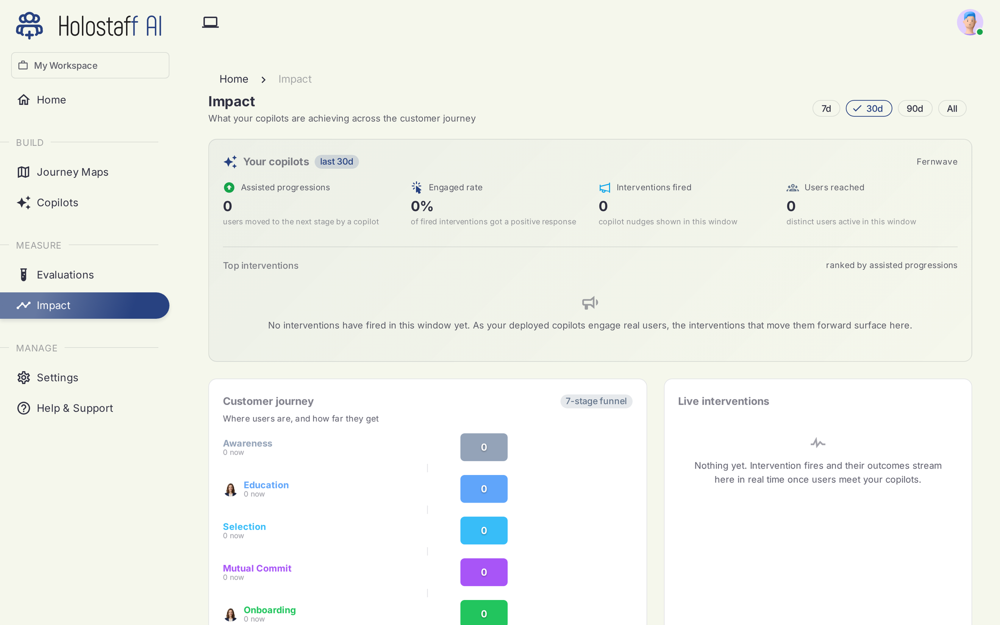

# Impact

Impact answers the only question that matters: what did your autopilots change?

## The top line

Four numbers, over a window you pick (7, 30, 90 days, or all time):

- **Assisted progressions** — users moved to the next stage by an assist
- **Engaged rate** — the share of offers that got a positive response
- **Assists shown** — autopilot assists shown in the window
- **Users reached** — distinct users an autopilot was active for

## Handovers are verified before they count

Every handover is logged with its full action trail. A handover counts as complete only when the workflow's goal state was actually reached (or the user confirmed it). Abandoned, stopped, or failed handovers are visible here too, but they are [never billed](../billing/index.md).

## Customer journey

The funnel across your seven stages, with live counts of where users are now and how they flow between stages. Stage colors match the journey map, so the funnel reads as the same product you scanned.

## The live feed

A real-time feed of activity as it lands. Right after a deploy this is the screen worth watching: it is the fastest way to see your autopilot meet its first real user.

!!! note "Fresh deploys start at zero"
    Impact attributes only what actually happened. A newly deployed autopilot shows zeros until real users hand something over; there is no synthetic or projected data on this page.
