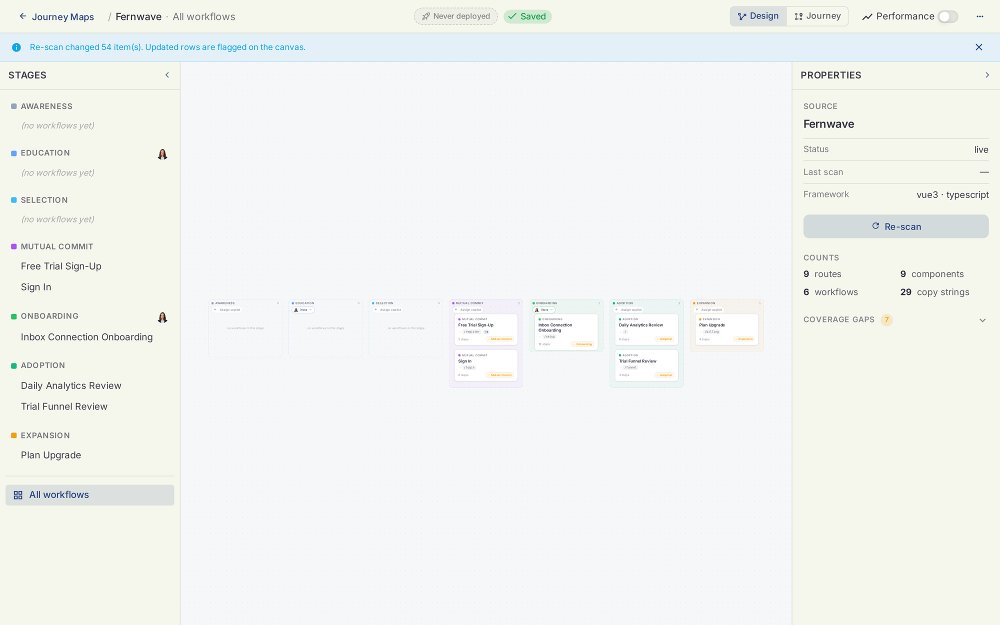
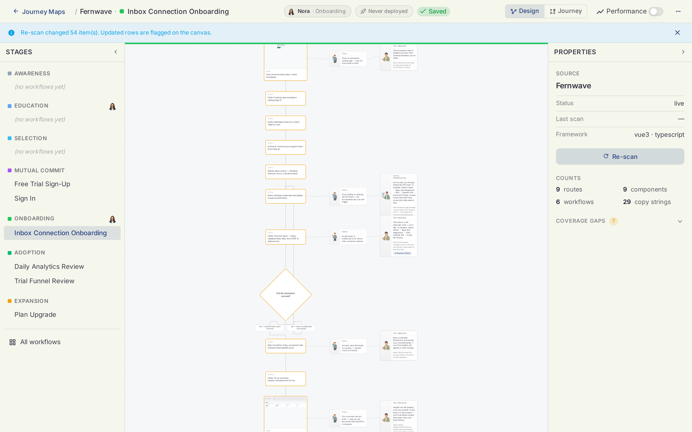
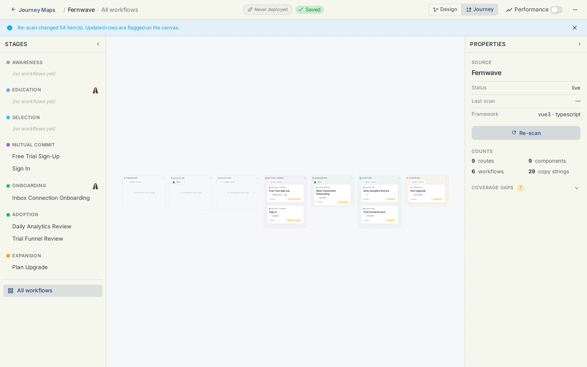

# The Canvas

Open any product from Journey Maps and you land on its canvas. This is where the scan's output becomes something you can read, question, and act on.

## The overview

The default view shows all workflows laid out under their stages, with the stage rail on the left and the product's properties on the right: source status, framework, last scan, and the counts (routes, workflows, components, copy strings).

## Inside a workflow

Click a workflow in the stage rail to open its flow. Each workflow is drawn as the user experiences it: steps, decisions, and the screens involved. Alongside the main path, the canvas shows the moments that matter:

- **Risk moments** — where this workflow loses users. Marked with the user sticker.
- **Handover moments** — what an autopilot could take over there. Marked with the autopilot sticker.
- **Page references** — the actual screens, rendered from your code, so the flow stays grounded in the real product.

## Design view and Journey view

The toggle in the top bar switches how you read the map:

- **Design** — the flowchart. Best for reviewing what the scan understood and where the risks are.
- **Journey** — the coverage board. The same workflows organized for action: which stage is covered and which workflows carry a certified autopilot.

## Coverage gaps

The properties panel counts coverage gaps: stages or risk moments with no workflow or no handover candidate. Gaps are normal after a first scan. They are the to-do list for your autopilot rollout.

## Re-scanning

Code moved? Click **Re-scan** in the properties panel, or run `/scan` again from the repo. The map updates in place and changed rows are flagged on the canvas so you can review what moved. Re-scans version the artifact; nothing you configured or deployed is lost.

!!! tip
    Scans bind to the repo through `.holostaff/source.json`, so every re-scan lands on the same source. See [the CLI reference](../cli/index.md#per-repo-source-binding).
