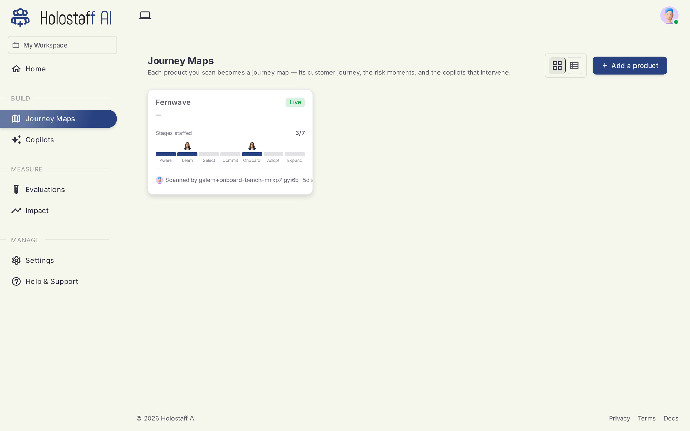

# Journey Maps

A Journey Map is what a scan produces: your product's customer journey, drawn from your code, live on a canvas.

It is not a diagram you maintain by hand. The CLI reads your repository and reconstructs what your product actually offers: the routes, the workflows, the copy users see, and the places where a user can stall. When your code changes, you re-scan and the map updates.

## The seven stages

Every map organizes your product's workflows along the customer journey:

1. **Awareness** — the user learns you exist
2. **Education** — they figure out what you do
3. **Selection** — they compare and decide
4. **Mutual Commit** — sign-up, sign-in, the moment both sides opt in
5. **Onboarding** — from account to first value
6. **Adoption** — the habit forms
7. **Expansion** — the account grows

The scan assigns each discovered workflow (for example "Free Trial Sign-Up" or "Inbox Connection Onboarding") to its stage. Stages with no workflows yet are visible too; they are your coverage gaps.

## What the scan finds

For each product the artifact holds:

- **Routes and components** — the surfaces users move through
- **Workflows** — multi-step user flows, each with its stage and steps
- **Risk moments** — where users stall, loop, or drop off
- **Proposed interventions** — what a copilot could do at each risk moment
- **Copy strings** — the literal text users see, with locations
- **Brand voice** — tone and keywords, so copilots sound like you

## One product, several repos

A product that spans multiple repositories can merge scans into one source: run `/scan --add-repo` from the second repo and pick the existing source. The map stays whole.

## Next

- [Working on the canvas](canvas.md)
- [Hire a copilot for a stage](../copilots/create.md)
